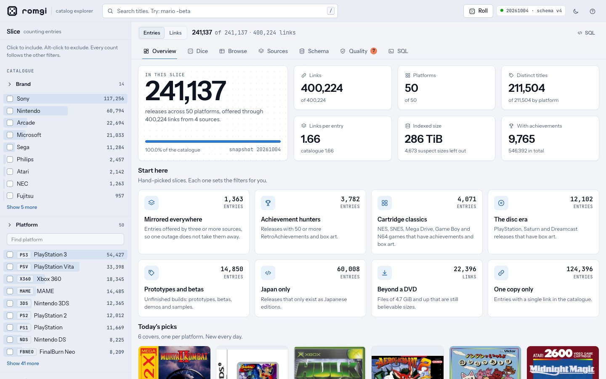
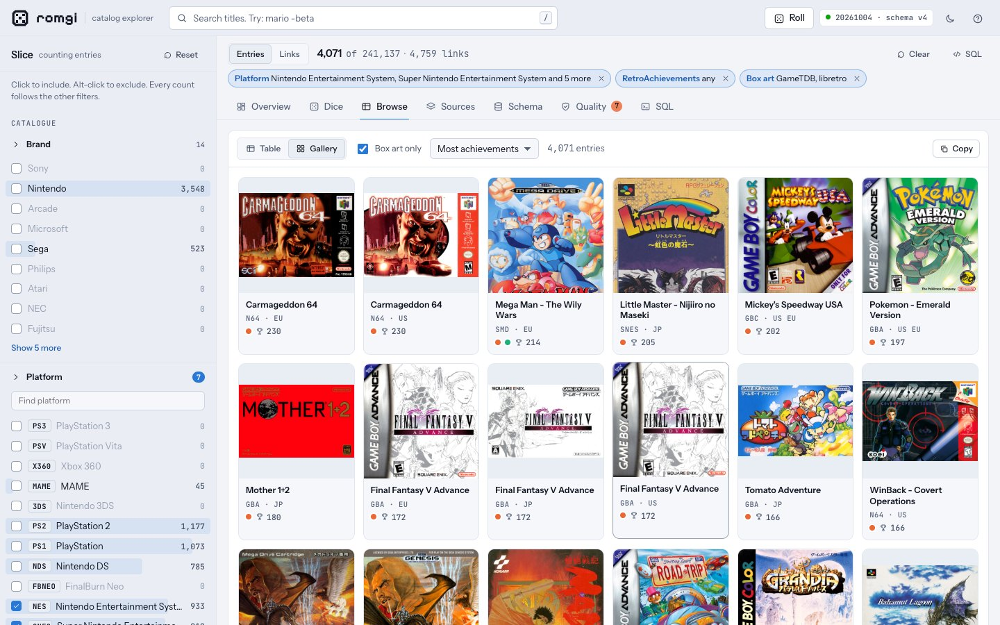
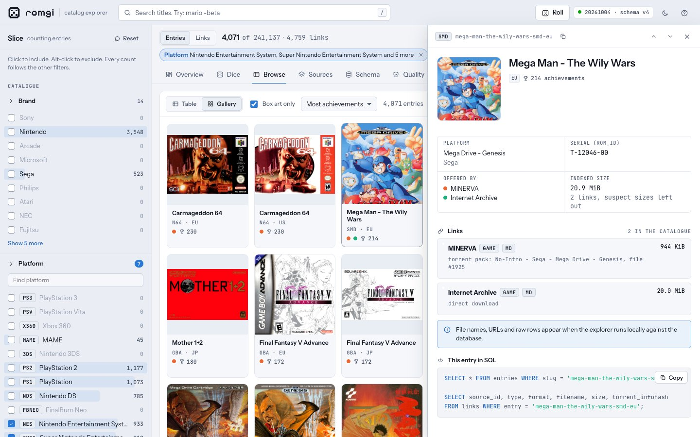
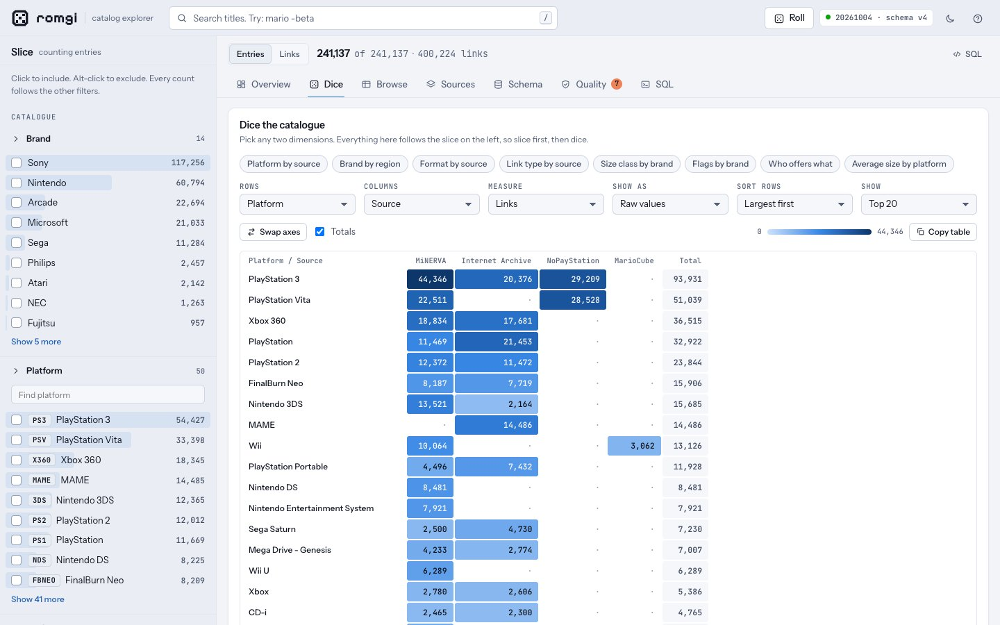
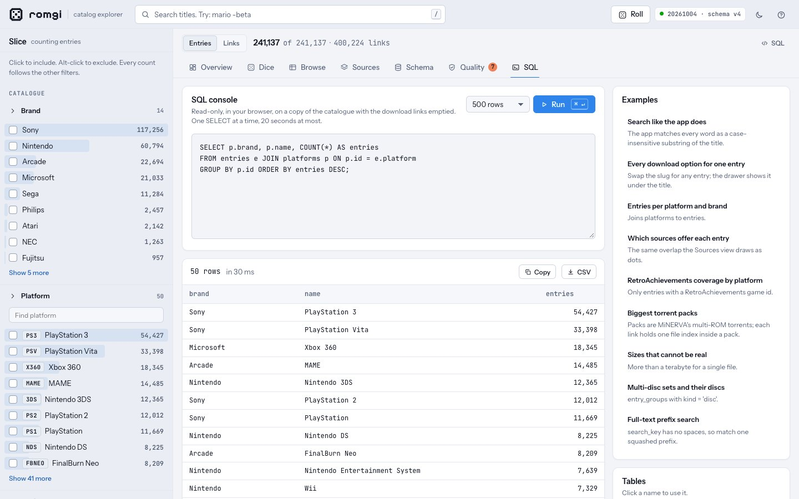
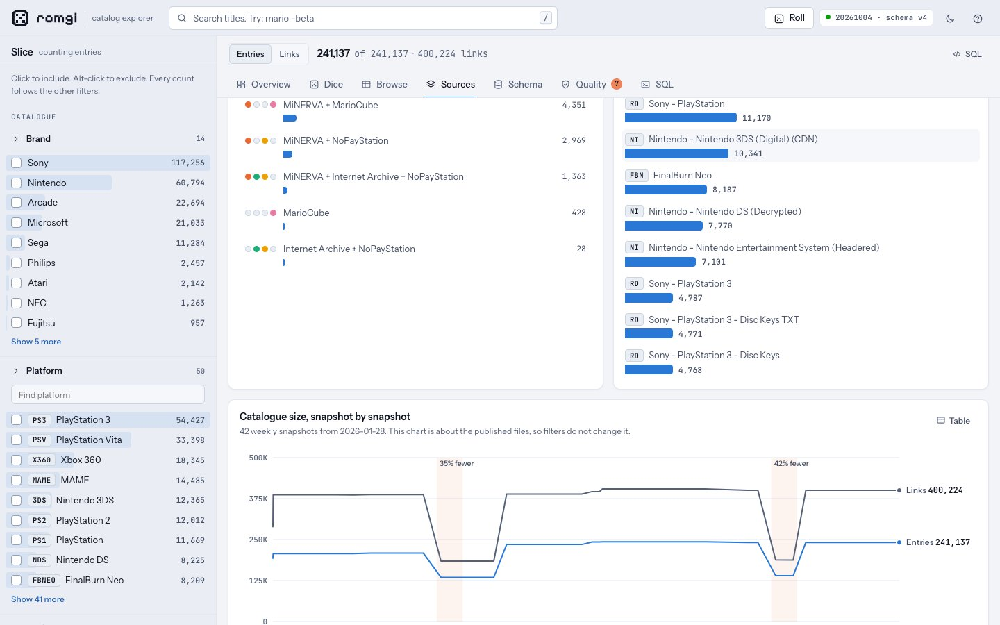
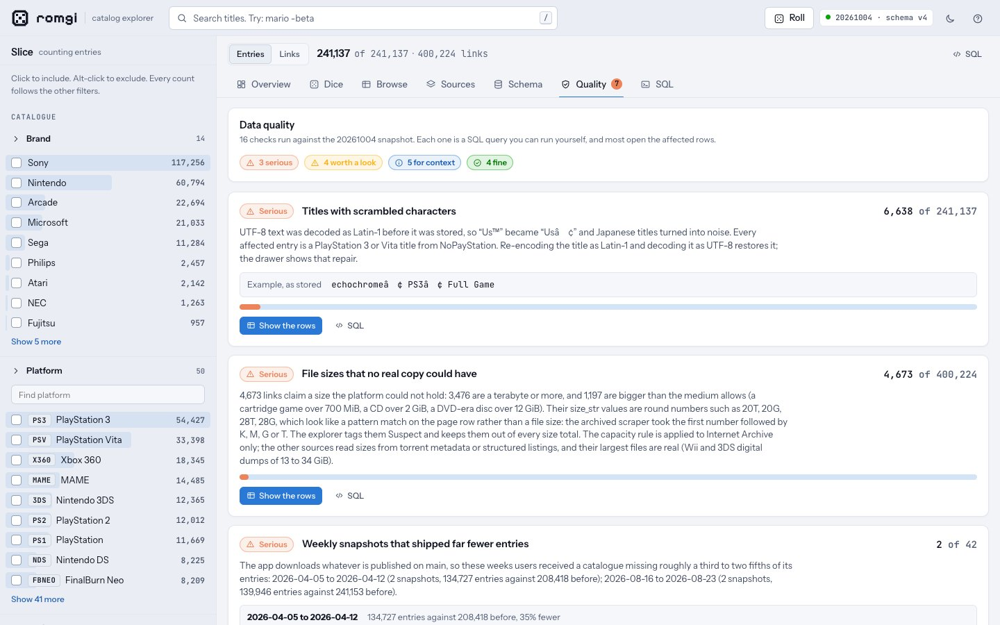
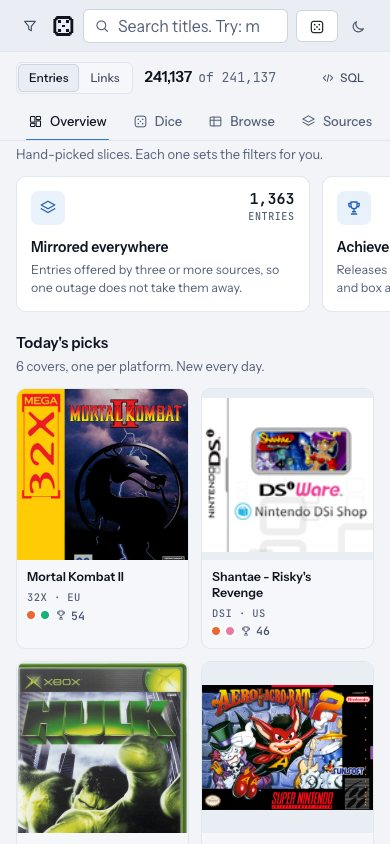

# romgi catalogue explorer

**Live: https://aldoruizluna.github.io/romgi-explorer/** · MIT · rebuilt by itself when romgi publishes



A browser UI for the database behind [caprado/romgi](https://github.com/caprado/romgi) (`db/romdb.db.gz`): every entry, every link,
and the metadata around them, sliceable and pivotable, with box art and a SQL console.

| | Local explorer | Live site |
|---|---|---|
| Data | your `romdb.db`, live | the latest weekly catalogue, rebuilt within hours of romgi publishing it |
| Box art | yes | yes, loaded from libretro and GameTDB while you look |
| SQL console | on the real database, file names and URLs included | in your browser, on a copy with the download links emptied (about 40 MB, downloaded the first time you run a query) |
| File names, URLs, torrent paths, CSV of a whole slice | yes | no |
| Needs | Python 3.9+ (standard library only) | a browser (a desktop one for the SQL console) |

## Run it locally

```bash
./run.sh
```

The first run downloads the published catalogue into `data/` (55 MB, 345 MB unpacked), builds a dataset from it (about 30 seconds,
cached in `dist/.cache/`) and opens http://127.0.0.1:8765. Later runs start at once. `./run.sh --refresh` fetches the latest
weekly catalogue; `ROMGI_OPEN=0 ./run.sh` skips opening a browser window.

To point it at a database you already have: `python3 serve.py --db path/to/romdb.db --version-json path/to/version.json --open`.
It listens on `127.0.0.1` only and opens the database read-only.

## What is in it

- **Overview** starts with eight hand-picked collections (mirrored everywhere, achievement hunters, cartridge classics, prototypes and
  betas, and more; each sets the filters for you) and a daily shelf of six covers, then the treemap of platforms, source mix, regions,
  size classes, release flags, link types, formats and coverage.
- **Dice** pivot any two dimensions (platform by source, brand by region, flags by brand, ...), as raw values, shares, or versus expected.
- **Browse** virtual table over 241k entries or 400k links, a box-art gallery (most achievements first, or A to Z, most sources, largest),
  and a catalogue-card drawer for every entry.
- **Sources** health, which combinations of sources offer each entry, torrent packs, and the catalogue size over the weekly snapshots.
- **Schema** ER diagram, DDL, a profile of every column, and where the bytes go.
- **Quality** 16 checks, each backed by a query. Findings in the 2026-10-04 snapshot include 6,638 titles with scrambled
  characters, 4,673 Internet Archive sizes no real copy could have (a Mega Drive game of 20 GiB, a Saturn disc of 28 GiB), two weeks where
  the published catalogue lost about 40% of its entries, and a torrent table with no sizes or files.
- **SQL** a read-only console with examples and a schema browser. Every view that prints a query has an "Open in SQL" button.

Everything on the left narrows entries and links together. The count beside each value is what you would get by adding it.
Alt-click excludes a value. The "SQL" button above the tabs prints the query that reproduces the current slice.

Shortcuts: `/` search, `R` roll a random entry, `G` then `O D B S M Q L` to jump between views, `T` theme, `?` help.

| | |
|---|---|
|  |  |
|  |  |
|  |  |

<p align="center"></p>

## The live site

[`pages.yml`](.github/workflows/pages.yml) runs on every push to `main` and every three hours. The scheduled run compares romgi's
`version.json` with the one the site ships and rebuilds only when romgi has published something new, so the site follows romgi within
hours and costs nothing in between. A rebuild downloads the published catalogue, adds any new snapshots to the history chart (and commits
them to `data/history.json`), builds the dataset, checks it against SQL, and deploys:

- a small `index.html` that paints at once with the headline numbers;
- the catalogue's numbers (0.9 MB gzip) as their own file that streams in with a progress bar and is parsed while it downloads. The
  counts, charts, filters and pivots all work from this file alone, so on a phone the page is usable after 0.9 MB, not the 4.8 MB it
  took when everything came in one file;
- the titles, serials, slugs and exact sizes (4.0 MB) as a second file that follows at once. Search, the Browse table and the size
  totals switch on when it lands, and until then they say so;
- the box-art paths as a third file, loaded once the titles are in, and the covers themselves only as they scroll into view;
- a link-free copy of the database (`livedb.py`) and [sql.js](https://github.com/sql-js/sql.js) (checked against a pinned hash), which
  the SQL console downloads only when someone runs a query, and then keeps in the browser.

A run that fails any step leaves the previous site up. The catalogue itself is never committed; it is fetched fresh each time. Fonts are
served from the site, so the only third-party requests are the cover images, and only for covers that are on screen. A dot beside the
version says whether the page matches romgi's latest catalogue.

The page carries `noindex`, so search engines are asked to skip it, but anyone with the link can open it. GitHub disables scheduled
workflows in a public repository after 60 days without repository activity. The commits the workflow makes when romgi publishes
should count as activity; if the schedule is ever disabled, re-enable it from the Actions tab. To build the same site yourself:

```bash
python3 build_dataset.py --db data/romdb.db --version-json data/version.json --out dist/dataset.snapshot.json.gz --art-out dist/art.snapshot.json.gz
python3 livedb.py data/romdb.db dist/livedb.sqlite.gz --gzip
python3 bundle.py --dataset dist/dataset.snapshot.json.gz --art dist/art.snapshot.json.gz --live-db dist/livedb.sqlite.gz --pages --out-dir site
python3 -m http.server --directory site 8790                                          # then open http://localhost:8790
```

## Files

```
run.sh              one-command launcher: download the catalogue, build, serve
serve.py            local server: dataset, per-entry rows, guarded SQL endpoint
build_dataset.py    romdb.db -> compact columnar dataset (+ schema, profiles, quality checks)
drift.py            guards: stops on a catalogue format it does not read, holds back a newest catalogue that is unfinished
livedb.py           romdb.db -> the link-free copy the hosted SQL console runs on
vendor_sqljs.py     fetches sql.js for the hosted site, verified against a pinned hash
bundle.py           builds the hosted site (--pages) or the single-file versions into dist/
compose.py          assembles the page from web/
refresh_history.py  adds the weekly snapshots published since data/history.json was written
web/                index.html, css/, js/ (util, data, engine, charts, views, collections, SQL in the browser),
                    worker/ (the SQL engine), fonts/ (self-hosted, OFL), og/ (the link-preview card)
data/history.json   weekly snapshot sizes, extracted from the romgi git history
docs/img/           the screenshots above
tests/              dataset-vs-SQL parity, a random-slice property test of the engine, the hosted files' transport, the engine
                    before and after the detail arrives, the link-free copy, and the browser SQL engine
.github/workflows/  pages.yml: the build that publishes the live site
```

## Tests

```bash
python3 build_dataset.py --db data/romdb.db --out dist/dataset.snapshot.json.gz
python3 tests/test_dataset.py data/romdb.db dist/dataset.snapshot.json.gz
node tests/engine.test.js data/romdb.db dist/dataset.snapshot.json.gz 40
python3 livedb.py data/romdb.db dist/livedb.sqlite.gz --gzip && python3 tests/test_livedb.py data/romdb.db dist/livedb.sqlite.gz
# after bundle.py --pages --live-db:
node tests/transport.test.js site/catalogue.*.bin site/detail.*.bin dist/dataset.snapshot.json.gz
node tests/early.test.js site/catalogue.*.bin site/detail.*.bin dist/dataset.snapshot.json.gz
node tests/sqlconsole.test.js dist/livedb.sqlite.gz site/vendor/sqljs dist/dataset.snapshot.json.gz
# a small catalogue with an invented fifth source, for the guards and the "new source" tests (about 10 seconds):
python3 tests/make_fixture.py data/romdb.db dist/fixture/romdb.db --extra-source
python3 build_dataset.py --db dist/fixture/romdb.db --version-json dist/fixture/version.json --out dist/fixture/dataset.json.gz
python3 tests/test_drift.py dist/fixture/romdb.db
node tests/sources.test.js dist/fixture/romdb.db dist/fixture/dataset.json.gz
# the built site in a real browser (npm install --no-save playwright-core; CHROME_PATH or /usr/bin/google-chrome):
node tests/smoke.test.js site
```

The first checks every flag, size class, region, source, pack and format count against SQL, and that the table is stored in the order
the printed SQL sorts by. The second draws random slices, filters and cross-tabs through the browser engine and compares each result with
the SQL the UI prints, compares the one-dimension fast paths with the general path, then does the same for every hand-picked collection.
The third checks that the link-free copy is the original minus only the download locators. The fourth unpacks the two hosted data
files the way the page does and checks that together they equal the dataset they were made from, that a page started from the first file
and given the second ends up identical to one built from the whole dataset, and that a missing or mismatched second file is refused
cleanly. The next one runs the engine from the first file alone, as the page does for the first few seconds, and checks it against
the whole dataset: counts, facets, collections and cross-tabs agree, the size measures answer with nothing instead of failing, and
once the detail arrives the size totals and the sort by size agree too. The last runs the browser's SQL engine: what may run, that
writes fail, CSV quoting, and every example the console offers.
`test_drift.py` breaks copies of a small catalogue (a renamed column, a dropped table, a fifth region, a link from an unknown source,
schema version 5) and checks each is refused with the reason, while a new source, table or column is only mentioned, then runs the
completeness rule over romgi's real weekly history: it must call exactly the six weeks that were about 40% short unfinished.
`sources.test.js` checks the explorer on a catalogue with a source it has never seen: colour slots, source counts, the "Offered by"
filter and its printed SQL against the database. `smoke.test.js` opens the built site in a real browser and uses it: the overview, a
search, a filter, a card, every view, the SQL console on the downloaded copy, a phone-width page, and that only expected hosts were asked for.

## Roadmap

[docs/ROADMAP.md](docs/ROADMAP.md) lays out what comes next: making the build robust to romgi changing, permalinks, grouping revisions
into games, a richer entry card, enrichment from reference datasets, a local-only personal shelf, and what "more sources" can and cannot
mean. Each item says why, how big it is and how we will know it worked.

## License

The explorer's code is [MIT](LICENSE). The catalogue it reads belongs to romgi and the sources it indexes; the license covers this
repository's code only. The live site also ships [sql.js](https://github.com/sql-js/sql.js) (MIT, its license is in `vendor/sqljs/`) and
the typefaces Instrument Sans, JetBrains Mono and Pixelify Sans (SIL Open Font License, texts in `fonts/`).

## Notes

The catalogue is distributed by romgi for use in romgi; its README says forks and derivative tools are not supported. The local
explorer reads a copy you download yourself. The live site carries the catalogue's titles, platforms, sizes, source names and the
paths of box-art images, and leaves out download URLs, file names, per-file torrent paths, magnets and infohashes (torrent packs
appear by name, and the SQL copy numbers them pack-001, pack-002, ...). Box art is fetched by your browser from
thumbnails.libretro.com and art.gametdb.com; GameTDB is sometimes slow or unreachable, in which case the card keeps its platform
placeholder.

The link-preview card (`web/og/og.png`) is rendered from `web/og/card.html`: open it in a browser at 1200 x 630 and take a screenshot.
GitHub's own social preview for the repository can only be set by uploading an image in the repository's settings.
