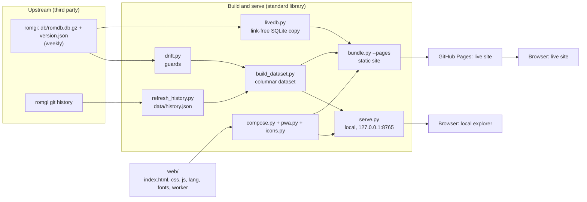

# Architecture: how romgi-explorer fits together

> **TL;DR.** romgi-explorer turns romgi's published SQLite catalogue (`romdb.db`) into a compact columnar *dataset*, and a browser app slices that dataset in memory
> (facets, pivots, a gallery, a SQL console). The same page is served two ways: locally by `serve.py` against your own database (file names and URLs included), or as a
> static GitHub Pages site built by `bundle.py` from a link-free copy. Python standard library only; the browser code is plain JavaScript concatenated in file order, with no bundler.

Related: [INDEX](INDEX.md) · [DEVELOPING](DEVELOPING.md) · [TESTING](TESTING.md) · [GLOSSARY](GLOSSARY.md) · [ROADMAP](ROADMAP.md) · [README](../README.md)

## The big picture

## What each Python file does

| File | Role | Reads | Writes |
|---|---|---|---|
| `run.sh` | one-command launcher: download the catalogue the first time (55 MB), build, serve | the network (romgi's release) | `data/romdb.db`, `data/version.json` |
| `drift.py` | guards. `check` stops on a catalogue format it does not read (unknown schema version, a documented table or column gone, a value that breaks the builder); `pick` holds back a newest catalogue that is unfinished (romgi twice published one about 40% short) | `romdb.db`, `version.json`, the history | exit status, a report |
| `build_dataset.py` | `romdb.db` to the columnar dataset: every filtered or grouped dimension is a flat array (one per catalogue row); single-record fields (file names, URLs, torrent paths) stay out of the arrays. Also profiles every column and runs the 16 quality checks' queries | `romdb.db`, `version.json`, `data/history.json` | `dataset.json.gz`; with `--local` adds box-art URLs and the local-server capabilities |
| `refresh_history.py` | appends the weekly snapshots romgi published since `data/history.json` was written (reads romgi's commit history over the GitHub API) | GitHub API | `data/history.json` |
| `livedb.py` | the copy the hosted SQL console runs on: romgi's whole database with the columns that say where a file can be downloaded emptied (`links.url`, `filename`, `source_url`, `torrent_file_path`, `torrents.magnet`, the torrent blob); torrent infohashes become `pack-001`, `pack-002`, ... so joins still work | `romdb.db` | `livedb.sqlite[.gz]` |
| `serve.py` | the local server: the dataset, per-entry rows, and a guarded SQL endpoint (one `SELECT` at a time under an authoriser, a row cap and a time limit); opens the database read-only; binds `127.0.0.1` only | `romdb.db`, the dataset cache in `dist/.cache/` | HTTP responses |
| `bundle.py` | builds the page: a single self-contained file, or with `--pages` the hosted site (a small `index.html`, `catalogue.<hash>.bin`, `detail.<hash>.bin`, the box-art paths, the link-free database, vendored sql.js, manifest, icons, service worker) | dataset, `web/`, livedb | `dist/` or `site/` |
| `compose.py` | assembles `web/index.html` + `web/css/*.css` + `web/js/*.js` (in filename order) into the page; self-hosted fonts; the `noindex` meta tag | `web/` | a string |
| `pwa.py`, `icons.py` | the web app manifest, the service worker's build id and file lists, and the app icons drawn without an image library | `web/sw.js` template | manifest, `sw.js`, icons |
| `vendor_sqljs.py` | fetches sql.js for the hosted site and checks the npm tarball against a pinned integrity hash before unpacking | npm registry | `site/vendor/sqljs/` |

## The local server: `serve.py`

| Route | Method | What |
|---|---|---|
| `/`, `/index.html` | GET | the page, composed from `web/` on every request (so editing `web/` and reloading is enough) |
| `/api/dataset` | GET | the dataset, gzip-encoded, from the cache in `dist/.cache/` (keyed on `BUILD_VERSION` in `build_dataset.py` and the database's size and mtime: **bump `BUILD_VERSION` when the dataset format changes**) |
| `/api/entry?slug=...` | GET | one entry's full row and its links (file names, URLs, torrent paths: local only) |
| `/api/slugs`, `/api/health` | GET | slug list; liveness |
| `/api/sql`, `/api/sqlcsv` | POST | the SQL console: one `SELECT` at a time under an authoriser, a row cap (`MAX_ROWS`) and a time limit; the second returns CSV |

Security: binds `127.0.0.1` only; the `Host` header must be `127.0.0.1` or `localhost`; POSTs also need the header `X-Romgi: 1`; the database is opened read-only.

## The browser app (`web/`)

`compose.py` concatenates `web/js/*.js` **in filename order**, so the numeric prefix is the load order and the architecture:

| Files | Role |
|---|---|
| `00-util.js`, `01-i18n.js` | helpers; language (English and Spanish) with `__()`, `__h()`, `__n()` and `N_()` |
| `10-data.js` | loads the dataset (the catalogue file first, the detail file after) and derives the arrays the engine uses |
| `20-engine.js` | facets, crossfilter counts, aggregation, and printing the SQL that reproduces the current slice |
| `30-charts.js` | thin marks, hairline grids, the treemap |
| `40-shell.js` | the facet rail, scope bar, tabs (`TABS`), routing, shortcuts, help |
| `41` to `49` | the views: overview, browse (table and gallery), dice, sources, schema, quality, SQL, collections, the browser SQL console |
| `50-url.js` | state in the address: a slice, a view and an open card round-trip through `#view?...` |
| `51-pwa.js` | the installed app: offline copy, quiet updates, "Reload" |

A view registers itself as `App.views.<id> = {...}` and appears when its `id` is in `TABS`. Filter values are *ids and names*, never indexes, so links keep their meaning when the catalogue is rebuilt.

## The hosted site and its guards

`.github/workflows/pages.yml` runs on every push to `main` and every three hours. A scheduled run compares romgi's `version.json` with the one the site ships and rebuilds only
when romgi has published something new. A rebuild: download the catalogue, run the two drift guards, add new snapshots to the history chart (committing `data/history.json`),
build the dataset, check it against SQL, and deploy. A run that fails any step leaves the previous site up. `workflow_dispatch` with `accept_latest` shows romgi's newest
catalogue even if it looks unfinished.

## What the hosted site never contains

Download URLs, file names, per-file torrent paths, magnets and infohashes. This is enforced by `livedb.py` and checked by `tests/test_livedb.py` (the copy is the original minus only the
download locators). The catalogue itself is never committed (`data/romdb.db*`, `dist/` and `site/` are git-ignored). Covers are fetched by the visitor's browser from
`thumbnails.libretro.com` and `art.gametdb.com`, only for covers on screen.

## Where state lives

| Place | What | In git? |
|---|---|---|
| `data/romdb.db`, `data/version.json` | the downloaded third-party catalogue | no |
| `data/history.json` | weekly snapshot sizes extracted from romgi's git history | yes |
| `dist/` (including `dist/.cache/`) | built datasets and the link-free copy | no |
| `site/` | the built hosted site | no |
| the browser | the language choice, the offline copy (service worker), the SQL console's database | n/a |

---

Related: [INDEX](INDEX.md) · [DEVELOPING](DEVELOPING.md) · [TESTING](TESTING.md) · [GLOSSARY](GLOSSARY.md) · [ROADMAP](ROADMAP.md) · [README](../README.md)
