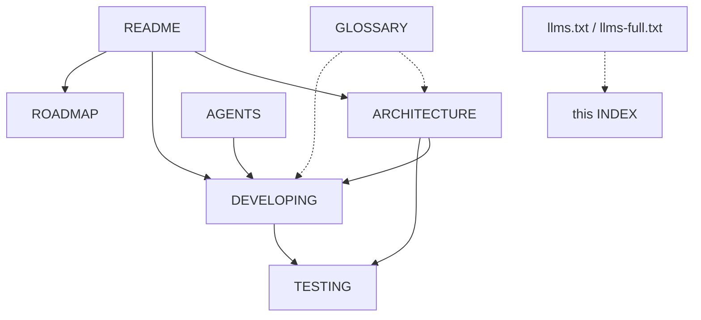

# Documentation map

> **TL;DR.** Every document in this repository and which to read first. Pick the row that matches what you want to do. Each document opens with a TL;DR and closes with a **Related** line.
> Tools and assistants: start at [llms.txt](../llms.txt) (the index) or [llms-full.txt](../llms-full.txt) (all the documentation in one file), and read [AGENTS.md](../AGENTS.md) before changing anything.

Related: [README](../README.md) · [ARCHITECTURE](ARCHITECTURE.md) · [DEVELOPING](DEVELOPING.md) · [TESTING](TESTING.md) · [GLOSSARY](GLOSSARY.md) · [AGENTS](../AGENTS.md)

## I want to ...

| I want to ... | Read |
|---|---|
| see what this is and run it | [README](../README.md) |
| understand how the data flows from romgi's database to the page | [ARCHITECTURE](ARCHITECTURE.md) |
| change the UI, the dataset or the build | [DEVELOPING](DEVELOPING.md), then [TESTING](TESTING.md) |
| run or add a test | [TESTING](TESTING.md) |
| work on it as an AI coding assistant | [AGENTS](../AGENTS.md), then [DEVELOPING](DEVELOPING.md) |
| look up a term (entry, grain, link-free copy, drift) | [GLOSSARY](GLOSSARY.md) |
| see what comes next and why | [ROADMAP](ROADMAP.md) |

## All documents

| Document | Kind | What it holds |
|---|---|---|
| [README](../README.md) | overview | what it is, local versus live site, how to run, what is in it, the live site's build, files, tests, languages, licence, notes |
| [ARCHITECTURE](ARCHITECTURE.md) | explanation | build and serve pipeline, the local server's routes and security, the browser app's files, the hosted site and its guards, where state lives |
| [DEVELOPING](DEVELOPING.md) | how-to | set up, the edit loop, conventions, recipes (view, collection, quality check, language, document) |
| [TESTING](TESTING.md) | reference | every test: command, prerequisites, what it checks, the order from a clean checkout |
| [GLOSSARY](GLOSSARY.md) | reference | one definition per term |
| [ROADMAP](ROADMAP.md) | plan | what comes next, why, how big, and how we will know it worked |
| [AGENTS](../AGENTS.md) | contract | rules and a map for AI coding assistants |
| [llms.txt](../llms.txt), [llms-full.txt](../llms-full.txt) | machine index | the documentation for language models: an index and a single-file copy |

## How they connect

## How the documentation is kept honest

`python3 tests/test_docs.py` fails when a relative link or anchor is broken, a document is missing from this map or from `llms.txt`, `llms-full.txt` is out of date, a document lacks its TL;DR
or Related line, or, with `ROMGI_PRIVATE_NAMES=name1,name2` in the environment, a document names a private project (the names are not written into this public repository). `python3 scripts/build-llms` regenerates `llms-full.txt` after any documentation change.

---

Related: [README](../README.md) · [ARCHITECTURE](ARCHITECTURE.md) · [DEVELOPING](DEVELOPING.md) · [TESTING](TESTING.md) · [GLOSSARY](GLOSSARY.md) · [AGENTS](../AGENTS.md) · [llms.txt](../llms.txt)
